<h1>🗂 Project</h1>  
> 스프링부트 REST API를 이용한 쇼핑몰 만들기  

<br>  

<h2>참고 및 출처</h2>  '아프리카도서관'님의 유튜브 영상  
Vue 3 강의 - 스프링부트 REST API를 이용하여 쇼핑몰 만들기(JPA, MariaDB, JWT)

<br>

<h2>목적</h2>    
실습 - 쇼핑몰 만들기

---

<h2>📕 INDEX</h2>  

[1. 도구 설치](#1-도구-설치)  
[2. 프로젝트 생성 - 프론트엔드](#2-프로젝트-생성---프론트엔드)  
[3. 프로젝트 생성 - 백엔드](#3-프로젝트-생성---백엔드)  
[4. 데이터베이스 세팅](#4-데이터베이스-세팅)  
[5. JPA로 데이터 조회](#5-jpa로-데이터-조회)  
[6. 상품 진열 및 DB 칼럼 추가](#6-상품-진열-및-db-칼럼-추가)  
[7. Vue Router 추가](#7-vue-router-추가)  
[8. 로그인 기능 구현](#8-로그인-기능-구현)  
[9. Vuex로 로그인 보완](#9-vuex로-로그인-보완)  
[10. JWT로 로그인 보완](#10-jwt로-로그인-보완)  
[11. 로그인 체크 로직 보완](#11-로그인-체크-로직-보완)  
[12. 장바구니 기능 구현 1](#12-장바구니-기능-구현-1)  
[13. 장바구니 기능 구현 2](#13-장바구니-기능-구현-2)  
[14. 장바구니 기능 구현 3](#14-장바구니-기능-구현-3)  
[15. 주문 기능 구현](#15-주문-기능-구현)  
[16. 기능 보완](#16-기능-보완)  
[17. 맺음말](#17-맺음말)  

---

# 1. 도구 설치
- 인텔리제이 (IntelliJ)
  - 본인은 인텔리제이 설치 안하고 vscode로 자바 관련 extensions 설치해서 사용하였음
- node.js
  - https://nodejs.org/ko (LTS 버전으로 다운로드)
- Vue CLI
  - https://cli.vuejs.org/guide/installation.html
  - ``npm install -g @vue/cli`` 명령어를 커맨드에 입력

<br>

---

# 2. 프로젝트 생성 - 프론트엔드
> 1. `` cd [프로젝트 위치] ``  
> ``vue create [프로젝트 이름]`` 으로 프로젝트 생성  
> 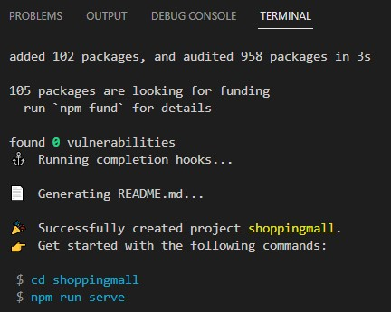
> 
> ``cd shoppingmall`` 명령어 입력 -> 해당 위치로 이동  
> ``npm run serve`` 명령어 입력  
>
> 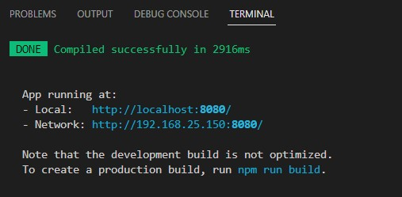  
> 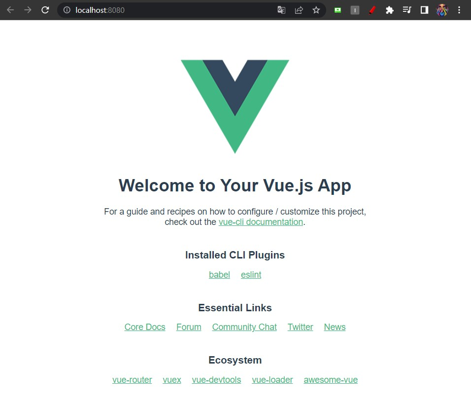  
> (웹페이지 실행 모습)  

<br>

> <h2> 2. UI 바꾸기 </h2>  
> 검색창에 cdnjs bootstrap  검색 후   
> https://cdnjs.com/libraries/bootstrap 로 이동 후 각각 밑에 있는 코드 복사  
> 
> ``index.html``에 코드 붙여넣기 (이미지 참고)

```html
<!-- html 복사 -->
<script src="https://cdnjs.cloudflare.com/ajax/libs/bootstrap/5.2.3/js/bootstrap.min.js" integrity="sha512-1/RvZTcCDEUjY/CypiMz+iqqtaoQfAITmNSJY17Myp4Ms5mdxPS5UV7iOfdZoxcGhzFbOm6sntTKJppjvuhg4g==" crossorigin="anonymous" referrerpolicy="no-referrer"></script>
```
```html
<!-- css 복사 -->
<link rel="stylesheet" href="https://cdnjs.cloudflare.com/ajax/libs/bootstrap/5.2.3/css/bootstrap.min.css" integrity="sha512-SbiR/eusphKoMVVXysTKG/7VseWii+Y3FdHrt0EpKgpToZeemhqHeZeLWLhJutz/2ut2Vw1uQEj2MbRF+TVBUA==" crossorigin="anonymous" referrerpolicy="no-referrer" />
```

> 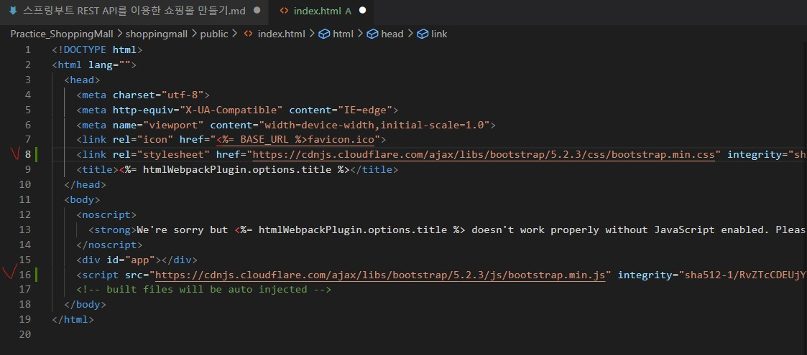  
> (빨간색 v자 체크된 부분에 각각 코드 붙여넣기)

<br>

> - 부트스트랩 공식 사이트 접속 후 예시 (Examples) 들어가기 -> **album** 들어가기 
> https://getbootstrap.kr/docs/5.2/examples/album/  
> <br>
> - (크롬 기준) [오른쪽 마우스 클릭] -> [페이지 소스보기] 클릭 후 ``<header>`` 태그 부분부터 ``</body>`` 태그 전 부분까지 복사하기
> - 복사 코드를 ``App.vue`` 파일의 ``<template>`` 태그 사이에 붙여넣기
> > 붙여넣기 전에 기존에 있던 ``<template>`` 태그 안에 있는 코드들은 지우고 붙여넣기

```html
<header>
  <div class="collapse bg-dark" id="navbarHeader">
    <div class="container">
      <div class="row">
        <div class="col-sm-8 col-md-7 py-4">
          <h4 class="text-white">About</h4>
          <p class="text-muted">Add some information about the album below, the author, or any other background context. Make it a few sentences long so folks can pick up some informative tidbits. Then, link them off to some social networking sites or contact information.</p>
        </div>
        <div class="col-sm-4 offset-md-1 py-4">
          <h4 class="text-white">Contact</h4>
          <ul class="list-unstyled">
            <li><a href="#" class="text-white">Follow on Twitter</a></li>
            <li><a href="#" class="text-white">Like on Facebook</a></li>
            <li><a href="#" class="text-white">Email me</a></li>
          </ul>
        </div>
      </div>
    </div>
  </div>
  <div class="navbar navbar-dark bg-dark shadow-sm">
    <div class="container">
      <a href="#" class="navbar-brand d-flex align-items-center">
        <svg xmlns="http://www.w3.org/2000/svg" width="20" height="20" fill="none" stroke="currentColor" stroke-linecap="round" stroke-linejoin="round" stroke-width="2" aria-hidden="true" class="me-2" viewBox="0 0 24 24"><path d="M23 19a2 2 0 0 1-2 2H3a2 2 0 0 1-2-2V8a2 2 0 0 1 2-2h4l2-3h6l2 3h4a2 2 0 0 1 2 2z"/><circle cx="12" cy="13" r="4"/></svg>
        <strong>Album</strong>
      </a>
      <button class="navbar-toggler" type="button" data-bs-toggle="collapse" data-bs-target="#navbarHeader" aria-controls="navbarHeader" aria-expanded="false" aria-label="Toggle navigation">
        <span class="navbar-toggler-icon"></span>
      </button>
    </div>
  </div>
</header>

<main>

  <section class="py-5 text-center container">
    <div class="row py-lg-5">
      <div class="col-lg-6 col-md-8 mx-auto">
        <h1 class="fw-light">Album example</h1>
        <p class="lead text-muted">Something short and leading about the collection below—its contents, the creator, etc. Make it short and sweet, but not too short so folks don’t simply skip over it entirely.</p>
        <p>
          <a href="#" class="btn btn-primary my-2">Main call to action</a>
          <a href="#" class="btn btn-secondary my-2">Secondary action</a>
        </p>
      </div>
    </div>
  </section>

  <div class="album py-5 bg-light">
    <div class="container">

      <div class="row row-cols-1 row-cols-sm-2 row-cols-md-3 g-3">
        <div class="col">
          <div class="card shadow-sm">
            <svg class="bd-placeholder-img card-img-top" width="100%" height="225" xmlns="http://www.w3.org/2000/svg" role="img" aria-label="Placeholder: Thumbnail" preserveAspectRatio="xMidYMid slice" focusable="false"><title>Placeholder</title><rect width="100%" height="100%" fill="#55595c"/><text x="50%" y="50%" fill="#eceeef" dy=".3em">Thumbnail</text></svg>

            <div class="card-body">
              <p class="card-text">This is a wider card with supporting text below as a natural lead-in to additional content. This content is a little bit longer.</p>
              <div class="d-flex justify-content-between align-items-center">
                <div class="btn-group">
                  <button type="button" class="btn btn-sm btn-outline-secondary">View</button>
                  <button type="button" class="btn btn-sm btn-outline-secondary">Edit</button>
                </div>
                <small class="text-muted">9 mins</small>
              </div>
            </div>
          </div>
        </div>
        <div class="col">
          <div class="card shadow-sm">
            <svg class="bd-placeholder-img card-img-top" width="100%" height="225" xmlns="http://www.w3.org/2000/svg" role="img" aria-label="Placeholder: Thumbnail" preserveAspectRatio="xMidYMid slice" focusable="false"><title>Placeholder</title><rect width="100%" height="100%" fill="#55595c"/><text x="50%" y="50%" fill="#eceeef" dy=".3em">Thumbnail</text></svg>

            <div class="card-body">
              <p class="card-text">This is a wider card with supporting text below as a natural lead-in to additional content. This content is a little bit longer.</p>
              <div class="d-flex justify-content-between align-items-center">
                <div class="btn-group">
                  <button type="button" class="btn btn-sm btn-outline-secondary">View</button>
                  <button type="button" class="btn btn-sm btn-outline-secondary">Edit</button>
                </div>
                <small class="text-muted">9 mins</small>
              </div>
            </div>
          </div>
        </div>
        <div class="col">
          <div class="card shadow-sm">
            <svg class="bd-placeholder-img card-img-top" width="100%" height="225" xmlns="http://www.w3.org/2000/svg" role="img" aria-label="Placeholder: Thumbnail" preserveAspectRatio="xMidYMid slice" focusable="false"><title>Placeholder</title><rect width="100%" height="100%" fill="#55595c"/><text x="50%" y="50%" fill="#eceeef" dy=".3em">Thumbnail</text></svg>

            <div class="card-body">
              <p class="card-text">This is a wider card with supporting text below as a natural lead-in to additional content. This content is a little bit longer.</p>
              <div class="d-flex justify-content-between align-items-center">
                <div class="btn-group">
                  <button type="button" class="btn btn-sm btn-outline-secondary">View</button>
                  <button type="button" class="btn btn-sm btn-outline-secondary">Edit</button>
                </div>
                <small class="text-muted">9 mins</small>
              </div>
            </div>
          </div>
        </div>

        <div class="col">
          <div class="card shadow-sm">
            <svg class="bd-placeholder-img card-img-top" width="100%" height="225" xmlns="http://www.w3.org/2000/svg" role="img" aria-label="Placeholder: Thumbnail" preserveAspectRatio="xMidYMid slice" focusable="false"><title>Placeholder</title><rect width="100%" height="100%" fill="#55595c"/><text x="50%" y="50%" fill="#eceeef" dy=".3em">Thumbnail</text></svg>

            <div class="card-body">
              <p class="card-text">This is a wider card with supporting text below as a natural lead-in to additional content. This content is a little bit longer.</p>
              <div class="d-flex justify-content-between align-items-center">
                <div class="btn-group">
                  <button type="button" class="btn btn-sm btn-outline-secondary">View</button>
                  <button type="button" class="btn btn-sm btn-outline-secondary">Edit</button>
                </div>
                <small class="text-muted">9 mins</small>
              </div>
            </div>
          </div>
        </div>
        <div class="col">
          <div class="card shadow-sm">
            <svg class="bd-placeholder-img card-img-top" width="100%" height="225" xmlns="http://www.w3.org/2000/svg" role="img" aria-label="Placeholder: Thumbnail" preserveAspectRatio="xMidYMid slice" focusable="false"><title>Placeholder</title><rect width="100%" height="100%" fill="#55595c"/><text x="50%" y="50%" fill="#eceeef" dy=".3em">Thumbnail</text></svg>

            <div class="card-body">
              <p class="card-text">This is a wider card with supporting text below as a natural lead-in to additional content. This content is a little bit longer.</p>
              <div class="d-flex justify-content-between align-items-center">
                <div class="btn-group">
                  <button type="button" class="btn btn-sm btn-outline-secondary">View</button>
                  <button type="button" class="btn btn-sm btn-outline-secondary">Edit</button>
                </div>
                <small class="text-muted">9 mins</small>
              </div>
            </div>
          </div>
        </div>
        <div class="col">
          <div class="card shadow-sm">
            <svg class="bd-placeholder-img card-img-top" width="100%" height="225" xmlns="http://www.w3.org/2000/svg" role="img" aria-label="Placeholder: Thumbnail" preserveAspectRatio="xMidYMid slice" focusable="false"><title>Placeholder</title><rect width="100%" height="100%" fill="#55595c"/><text x="50%" y="50%" fill="#eceeef" dy=".3em">Thumbnail</text></svg>

            <div class="card-body">
              <p class="card-text">This is a wider card with supporting text below as a natural lead-in to additional content. This content is a little bit longer.</p>
              <div class="d-flex justify-content-between align-items-center">
                <div class="btn-group">
                  <button type="button" class="btn btn-sm btn-outline-secondary">View</button>
                  <button type="button" class="btn btn-sm btn-outline-secondary">Edit</button>
                </div>
                <small class="text-muted">9 mins</small>
              </div>
            </div>
          </div>
        </div>

        <div class="col">
          <div class="card shadow-sm">
            <svg class="bd-placeholder-img card-img-top" width="100%" height="225" xmlns="http://www.w3.org/2000/svg" role="img" aria-label="Placeholder: Thumbnail" preserveAspectRatio="xMidYMid slice" focusable="false"><title>Placeholder</title><rect width="100%" height="100%" fill="#55595c"/><text x="50%" y="50%" fill="#eceeef" dy=".3em">Thumbnail</text></svg>

            <div class="card-body">
              <p class="card-text">This is a wider card with supporting text below as a natural lead-in to additional content. This content is a little bit longer.</p>
              <div class="d-flex justify-content-between align-items-center">
                <div class="btn-group">
                  <button type="button" class="btn btn-sm btn-outline-secondary">View</button>
                  <button type="button" class="btn btn-sm btn-outline-secondary">Edit</button>
                </div>
                <small class="text-muted">9 mins</small>
              </div>
            </div>
          </div>
        </div>
        <div class="col">
          <div class="card shadow-sm">
            <svg class="bd-placeholder-img card-img-top" width="100%" height="225" xmlns="http://www.w3.org/2000/svg" role="img" aria-label="Placeholder: Thumbnail" preserveAspectRatio="xMidYMid slice" focusable="false"><title>Placeholder</title><rect width="100%" height="100%" fill="#55595c"/><text x="50%" y="50%" fill="#eceeef" dy=".3em">Thumbnail</text></svg>

            <div class="card-body">
              <p class="card-text">This is a wider card with supporting text below as a natural lead-in to additional content. This content is a little bit longer.</p>
              <div class="d-flex justify-content-between align-items-center">
                <div class="btn-group">
                  <button type="button" class="btn btn-sm btn-outline-secondary">View</button>
                  <button type="button" class="btn btn-sm btn-outline-secondary">Edit</button>
                </div>
                <small class="text-muted">9 mins</small>
              </div>
            </div>
          </div>
        </div>
        <div class="col">
          <div class="card shadow-sm">
            <svg class="bd-placeholder-img card-img-top" width="100%" height="225" xmlns="http://www.w3.org/2000/svg" role="img" aria-label="Placeholder: Thumbnail" preserveAspectRatio="xMidYMid slice" focusable="false"><title>Placeholder</title><rect width="100%" height="100%" fill="#55595c"/><text x="50%" y="50%" fill="#eceeef" dy=".3em">Thumbnail</text></svg>

            <div class="card-body">
              <p class="card-text">This is a wider card with supporting text below as a natural lead-in to additional content. This content is a little bit longer.</p>
              <div class="d-flex justify-content-between align-items-center">
                <div class="btn-group">
                  <button type="button" class="btn btn-sm btn-outline-secondary">View</button>
                  <button type="button" class="btn btn-sm btn-outline-secondary">Edit</button>
                </div>
                <small class="text-muted">9 mins</small>
              </div>
            </div>
          </div>
        </div>
      </div>
    </div>
  </div>

</main>

<footer class="text-muted py-5">
  <div class="container">
    <p class="float-end mb-1">
      <a href="#">Back to top</a>
    </p>
    <p class="mb-1">Album example is &copy; Bootstrap, but please download and customize it for yourself!</p>
    <p class="mb-0">New to Bootstrap? <a href="/">Visit the homepage</a> or read our <a href="/docs/5.2/getting-started/introduction/">getting started guide</a>.</p>
  </div>
</footer>
```

<br>

> ``App.vue``의 ``<script>`` 부분 수정
```html
<script>
<!-- import HelloWorld from './components/HelloWorld.vue' 지우기 -->

export default {
  name: 'App',
  components: {
    <!-- HelloWorld 지우기 --> 
  }
}
</script>
```
<br>

> - (크롬 기준) [오른쪽 마우스 클릭] -> [페이지 소스보기] 클릭 후 ``<style>`` 태그 부분부터 ``</style>`` 태그 부분까지 복사하기

```css
      .bd-placeholder-img {
        font-size: 1.125rem;
        text-anchor: middle;
        -webkit-user-select: none;
        -moz-user-select: none;
        user-select: none;
      }

      @media (min-width: 768px) {
        .bd-placeholder-img-lg {
          font-size: 3.5rem;
        }
      }

      .b-example-divider {
        height: 3rem;
        background-color: rgba(0, 0, 0, .1);
        border: solid rgba(0, 0, 0, .15);
        border-width: 1px 0;
        box-shadow: inset 0 .5em 1.5em rgba(0, 0, 0, .1), inset 0 .125em .5em rgba(0, 0, 0, .15);
      }

      .b-example-vr {
        flex-shrink: 0;
        width: 1.5rem;
        height: 100vh;
      }

      .bi {
        vertical-align: -.125em;
        fill: currentColor;
      }

      .nav-scroller {
        position: relative;
        z-index: 2;
        height: 2.75rem;
        overflow-y: hidden;
      }

      .nav-scroller .nav {
        display: flex;
        flex-wrap: nowrap;
        padding-bottom: 1rem;
        margin-top: -1px;
        overflow-x: auto;
        text-align: center;
        white-space: nowrap;
        -webkit-overflow-scrolling: touch;
      }
```

<br>

> <h2> 💡 문제점 </h2>  
>  
> ``App.vue`` 파일의 ``<header>``, ``<main>``, ``<footer>`` 부분이 너무 길다.  
> -> 각각 ``<header>``, ``<main>``, ``<footer>`` 부분을 컴포넌트화 하자!
> 
> <br>  
> <h3> 방법 </h3>  
> 
> 1. [src] -> [components] 폴더 안에 ``Header.vue`` 파일 생성
> 2. [src] -> [components] 폴더 안에 ``Footer.vue`` 파일 생성
> 3. [src] -> [pages] 폴더 안에 ``Home.vue`` 파일 생성  
> 4. ``App.vue``에서 ``<header>``, ``<footer>``, ``<main>`` 태그 부분을 각각    
> ``Header.vue``, ``Footer.vue``, ``Home.vue`` 파일 안에 ``<template>`` 태그를 만들고 그 안에 붙여 넣는다.
>> ``Home.vue``는 ``<main>`` 태그를 ``<div clas="home">``로 바꿔준다. 

<br>

```html
<!-- 예시) App.vue에 있던 <header> 태그 부분을 Header.vue 파일 안의 <template> 태그 부분에 붙여 넣는다.-->
<template>
<header>
  <div class="collapse bg-dark" id="navbarHeader">
    <div class="container">
      <div class="row">
        <div class="col-sm-8 col-md-7 py-4">
          <h4 class="text-white">About</h4>
          <p class="text-muted">Add some information about the album below, the author, or any other background context. Make it a few sentences long so folks can pick up some informative tidbits. Then, link them off to some social networking sites or contact information.</p>
        </div>
        <div class="col-sm-4 offset-md-1 py-4">
          <h4 class="text-white">Contact</h4>
          <ul class="list-unstyled">
            <li><a href="#" class="text-white">Follow on Twitter</a></li>
            <li><a href="#" class="text-white">Like on Facebook</a></li>
            <li><a href="#" class="text-white">Email me</a></li>
          </ul>
        </div>
      </div>
    </div>
  </div>
  <div class="navbar navbar-dark bg-dark shadow-sm">
    <div class="container">
      <a href="#" class="navbar-brand d-flex align-items-center">
        <svg xmlns="http://www.w3.org/2000/svg" width="20" height="20" fill="none" stroke="currentColor" stroke-linecap="round" stroke-linejoin="round" stroke-width="2" aria-hidden="true" class="me-2" viewBox="0 0 24 24"><path d="M23 19a2 2 0 0 1-2 2H3a2 2 0 0 1-2-2V8a2 2 0 0 1 2-2h4l2-3h6l2 3h4a2 2 0 0 1 2 2z"/><circle cx="12" cy="13" r="4"/></svg>
        <strong>Album</strong>
      </a>
      <button class="navbar-toggler" type="button" data-bs-toggle="collapse" data-bs-target="#navbarHeader" aria-controls="navbarHeader" aria-expanded="false" aria-label="Toggle navigation">
        <span class="navbar-toggler-icon"></span>
      </button>
    </div>
  </div>
</header>
</template>
```

<br>

> 5. App.vue 파일에서 ``<template>`` 태그 안의 모든 코드를 지우고  
> 다음 코드를 삽입한다.

```html
<template>
  <Header />
  <Home />
  <Footer />
</template>
```

> 6. package.json 파일에서 "rules" 부분에 다음 코드를 삽입한다.
>> "vue/multi-word-component-names": 0
```json
{   ...
    "extends": [
      "plugin:vue/vue3-essential",
      "eslint:recommended"
    ],
    "parserOptions": {
      "parser": "@babel/eslint-parser"
    },
    "rules": {"vue/multi-word-component-names": 0}
  },
  "browserslist": [
    "> 1%",
    "last 2 versions",
    "not dead",
    "not ie 11"
  ]
}

```

<br>

> 7. ``App.vue`` 파일의 ``<script>`` 부분에서 다음과 같이 수정

```js
import Header from "@/components/Header";
import Footer from "@/components/Footer";
import Home from "@/pages/Home";
export default {
  name: 'App',
  components: {
    Header, 
    Home,
    Footer
  }
}
```

<br>

> 8. ``Home.vue`` 파일 코드를 분석하면  
> 특정 코드를 기준으로 반복되는 구간이 있다.  
> -> **컴포넌트화** 해서 중복을 최소화하고 코드를 간결화 하는 작업을 수행한다.

```js
// 반복되는 코드
// 하나만 남기고 반복되는 코드는 모두 삭제한다.
<div class="col"> 
          <div class="card shadow-sm">
            <svg class="bd-placeholder-img card-img-top" width="100%" height="225" xmlns="http://www.w3.org/2000/svg" role="img" aria-label="Placeholder: Thumbnail" preserveAspectRatio="xMidYMid slice" focusable="false"><title>Placeholder</title><rect width="100%" height="100%" fill="#55595c"/><text x="50%" y="50%" fill="#eceeef" dy=".3em">Thumbnail</text></svg>

            <div class="card-body">
              <p class="card-text">This is a wider card with supporting text below as a natural lead-in to additional content. This content is a little bit longer.</p>
              <div class="d-flex justify-content-between align-items-center">
                <div class="btn-group">
                  <button type="button" class="btn btn-sm btn-outline-secondary">View</button>
                  <button type="button" class="btn btn-sm btn-outline-secondary">Edit</button>
                </div>
                <small class="text-muted">9 mins</small>
              </div>
            </div>
          </div>
        </div>
```

> 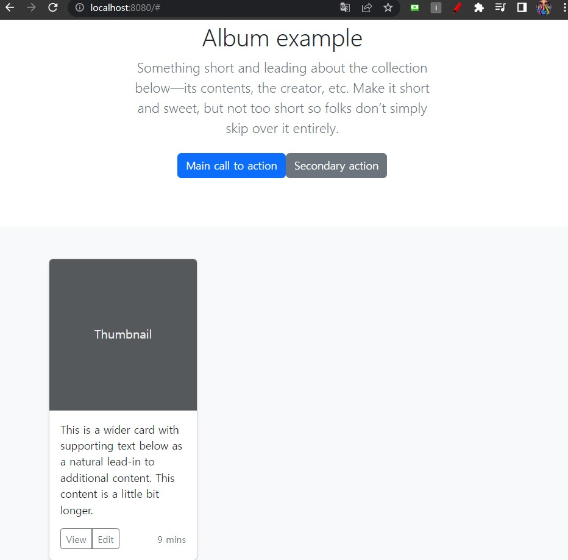  
> ( 이미지: 중복 코드를 하나만 남기고 모두 삭제하였을 때 썸네일 부분이 하나만 나오는 것을 확인)

<br>

> 9. [components] 폴더에 ``Card.vue`` 파일을 만든 후 아래와 같이 코드를 작성한다.
> > ``<template>`` 코드 안에 하나만 남긴 코드를 넣는다.

```js
<template>
          <div class="card shadow-sm">
            <svg class="bd-placeholder-img card-img-top" width="100%" height="225" xmlns="http://www.w3.org/2000/svg" role="img" aria-label="Placeholder: Thumbnail" preserveAspectRatio="xMidYMid slice" focusable="false"><title>Placeholder</title><rect width="100%" height="100%" fill="#55595c"/><text x="50%" y="50%" fill="#eceeef" dy=".3em">Thumbnail</text></svg>

            <div class="card-body">
              <p class="card-text">This is a wider card with supporting text below as a natural lead-in to additional content. This content is a little bit longer.</p>
              <div class="d-flex justify-content-between align-items-center">
                <div class="btn-group">
                  <button type="button" class="btn btn-sm btn-outline-secondary">View</button>
                  <button type="button" class="btn btn-sm btn-outline-secondary">Edit</button>
                </div>
                <small class="text-muted">9 mins</small>
              </div>
            </div>
          </div>
</template>

<script>
export default {
    name: 'Card',
}
</script>

<style scoped>
</style>
```

<br>

> 10. ``Home.vue`` 에서 다음 코드로 수정

```html
<!-- <div class="col" 밑에 <Card /> 추가 -->
...

 <div class="album py-5 bg-light">
    <div class="container">

      <div class="row row-cols-1 row-cols-sm-2 row-cols-md-3 g-3">
        <div class="col">
        <Card />  <!-- 추가 -->
        </div>
      </div>
    </div>
  </div>
</div>
</template>

```

<br>

> 11. ``Home.vue`` 파일에서 ``<div class="col">`` 부분 수정
>> v-for="i in 12" :key="i" 추가
``` html
...

 <div class="album py-5 bg-light">
    <div class="container">

      <div class="row row-cols-1 row-cols-sm-2 row-cols-md-3 g-3">
        <div class="col" v-for="i in 12" :key="i">
        <Card /> 
        </div>
      </div>
    </div>
  </div>
</div>
</template>
```

> 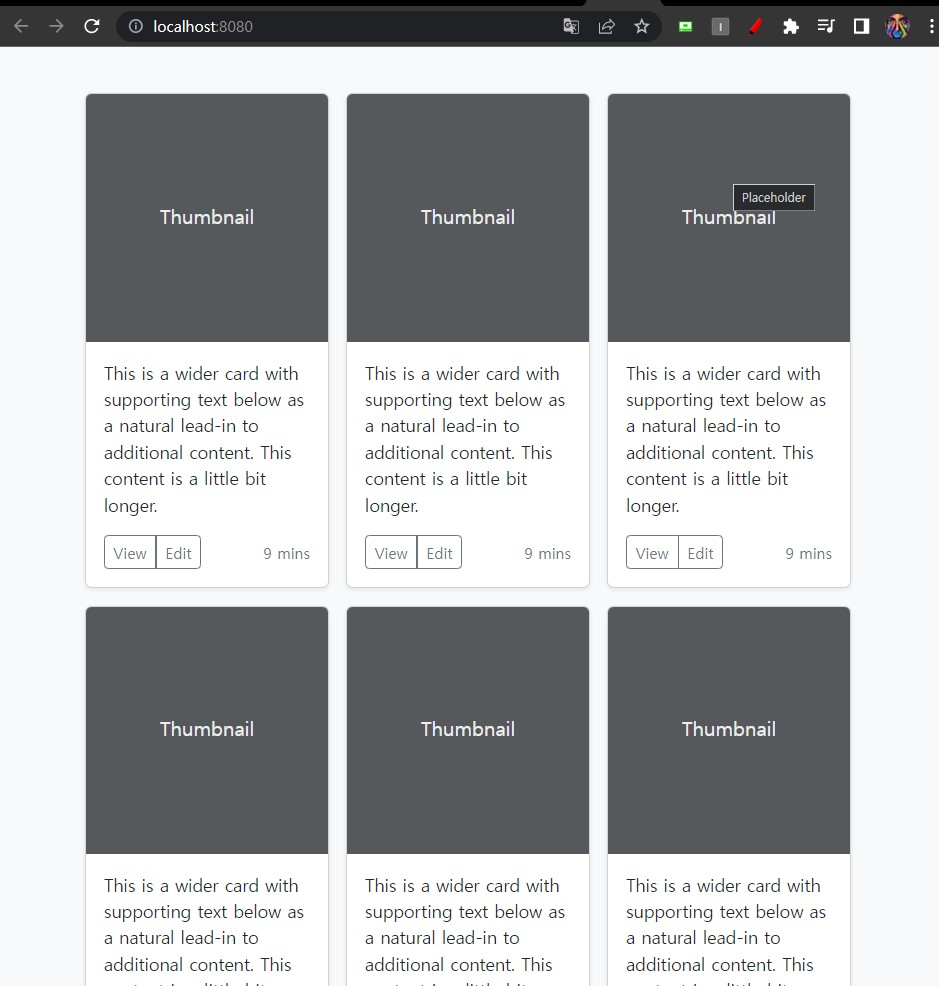  
> (이미지: 총 12개의 썸네일 모양 생성)

<br>
<br>  
<br>

--- 

# 3. 프로젝트 생성 - 백엔드
> 1. (vscode기준) Ctrl + Shift + p키를 눌러 **Spring Initializer: Create a Gradle Project** 선택
> > 없으면 Extensions에서 Java, Spring Boot 관련 Extensions 다운받기  
> <br>
> 
> 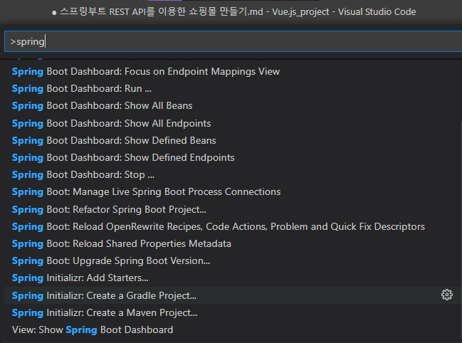
> 
<br>

> <h2>2. 그 후 순서대로 창에 다음과 같이 입력한다.</h2>  
> 
> - 언어: Java
> - Group: org.africalib.gallery.backend (설정 자유)
> - ArtifactId: demo (설정 자유)
> - Packaging: jar
> - Java ver.: 17
> - Web: Spring Web  
  
> <h2>3. 왼쪽 Spring Boot Dashboard 탭에서 [run]을 클릭하고</h2>  
> 
> 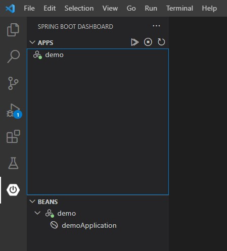  

> <h2> 4. 인터넷 창에 localhost:8080을 입력하여</h2>  
> 
> 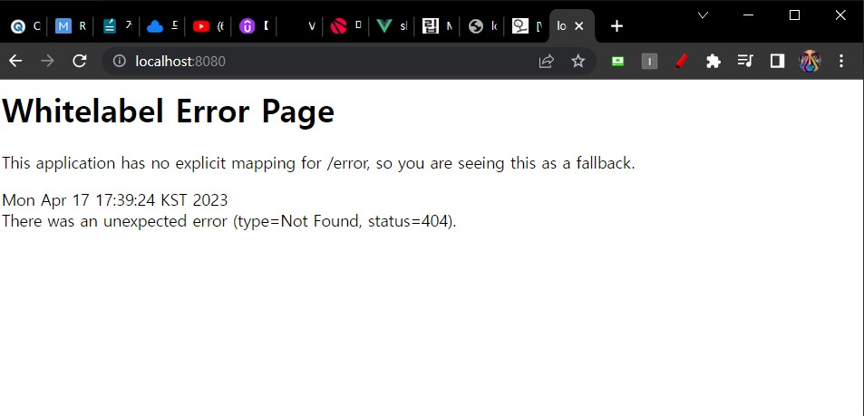
> 이 창이 뜨면 세팅 성공

<br>
<br>
<br>

---

> [src] -> [main] -> [설정한 group 폴더] 에  
> ``ItemController``라는 새로운 클래스 파일 생성

```java
// ItemContoroller.java

package org.africalib.gallery.backend.demo;

import java.util.ArrayList;
import java.util.List; 
import org.springframework.web.bind.annotation.GetMapping;
import org.springframework.web.bind.annotation.RestController;

@RestController
public class ItemController {

    @GetMapping("/api/items")
    public List<String> getItems() {
        List<String> items = new ArrayList<>();
        items.add("alpha");
        items.add("beta");
        items.add("gamma");

        return items;
    }
}

```
> 코드 작성 후  
> ``localhost:8080/api/items`` 접속
> 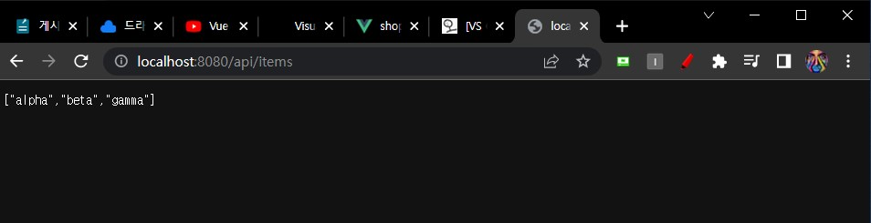  

---

> localhost 포트 번호가 8080인데 프론트와 백엔드 쪽 포트가 겹쳐서  
> 프론트쪽 포트 번호를 변경하고자 한다.
>> 명령어 ``npm run serve``로 서버를 실행하는 경우,  
>> 명령창에 ``npm run serve -- --port 번호``를 입력한다.
>>> 예시) ``npm run serve -- --port 3000``

>> 혹은 **package.json** 파일에서   
>> ```json
>> "serve": "vue-cli- service serve --port 번호",
>> ```
>> 로 수정한다.
>> 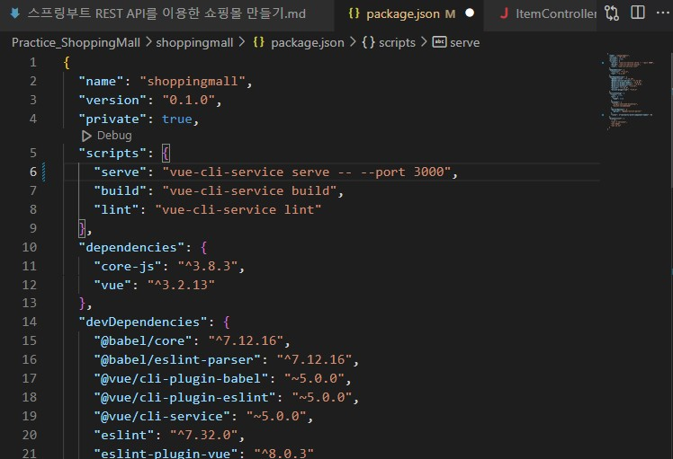 

<br>
<br>

> 이제 http 통신을 해야 한다.  
> 통신을 하려면 프론트에서 백엔드에 API를 요청한다.  
> <br>  
> 프론트 만들었던 위치에 가서 명령어 창 하나 더 열고  
> ``npm install axios``를 입력하고 axios를 설치한다.

<br>

> **Home.vue**로 가서 ``<script>`` 태그를 다음과 같이 수정한다.

```js
<script>
import Card from "@/components/Card";
import axios from "axios";

export default {
    name: "Home",
    components: {Card},
    setup() {
      axios.get("/api/items").then((res) => {
        console.log(res);
      })
    }
}
</script>
```

> **vue.config.js** 파일을 열어 다음과 같이 수정한다.

```js
module.exports ={
  devServer: {
    proxy: {
      '/api': {
        target:'http://localhost:8080',
      }
    }
  }
}
```

<br>  

> 이제는 데이터를 받은 만큼 카드를 만들어 볼 것이다.  
> **Home.vue** 파일에서 ``<script>`` 태그를 다음과 같이 수정한다.

```js
<script>

import axios from "axios";
import { reactive } from "vue";
import Card from "@/components/Card";

export default {
    name: "Home",
    components: {Card},
    setup() {
      const state = reactive({
        items:[]
      })
      axios.get("/api/items").then(({data}) => {
        state.items = data;
      })

      return { state }
    }
}
</script>
```

> ``<script>`` 태그 위에 일부 코드를 수정한다.

```js
...

  <div class="album py-5 bg-light">
    <div class="container">

      <div class="row row-cols-1 row-cols-sm-2 row-cols-md-3 g-3">
        <div class="col" v-for="(item, idx) in state.items" :key="idx">
        <Card :item = "item"/>
        </div>
      </div>
    </div>
  </div>
</div>

...

```

> 그 다음에 **Card.vue** 파일에서 ``<script>`` 태그의 일부 코드를 수정한다.
```js
<script>
export default {
    name: 'Card',
    props: {
      item: String
    }
}
</script>
```

> ``<template>`` 태그 안 ``card-text`` 속성에 다음과 같이 코드를 수정한다.

```html
<p class="card-text">{{ item }}</p>
```

> 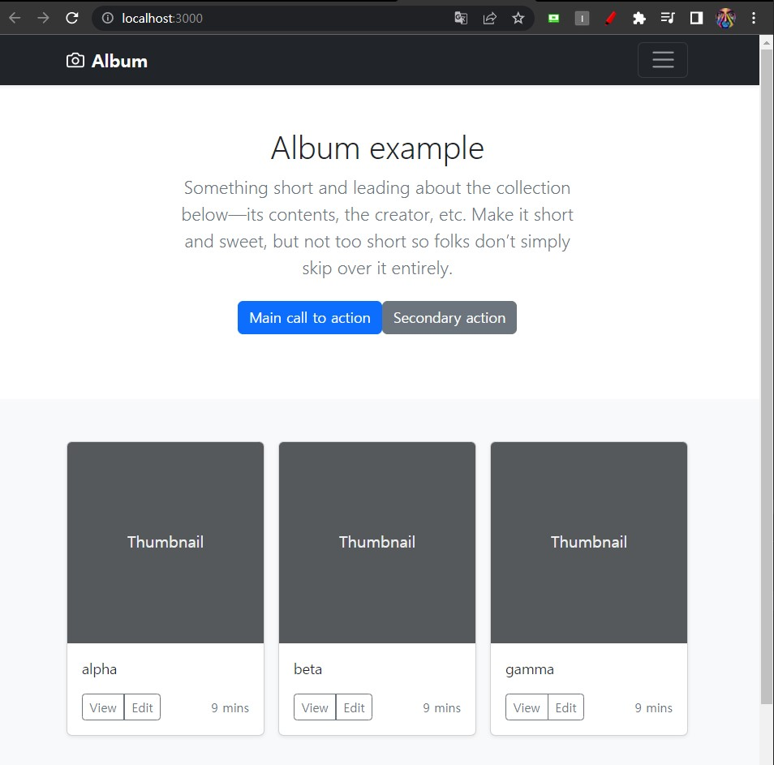  
> (썸네일 레이아웃 안에 ``items`` 단어들이 들어간 것을 확인 가능)

<br>
<br>

---

# 4. 데이터베이스 세팅

> 1. 마리아 DB 공식 사이트 들어가서 마리아DB 다운로드
>> https://mariadb.org/download/?t=mariadb&p=mariadb&r=10.11.2&os=windows&cpu=x86_64&pkg=msi&m=blendbyte

> 2. 마리아 DB 설치
> 3. VSCode의 Extensions에서 MySQL 설치
> 4. 설치되면 나오는 왼쪽 사이드바의 Database에서 **Add Connection** 눌러서 MariaDB와 연동
> 5. 쿼리문으로 **gallery** 데이터베이스 만들고  
> 그 안에 **items**라고 하는 테이블을 만든다.

```sql
CREATE TABLE items(
id int auto_increment,
name varachar(50) not null,
constraint items_pk
primary key (id)
);
```
> 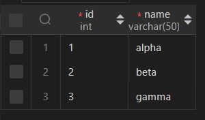  
> 테이블 안에 이미지와 같이 데이터 입력 후 저장

<br>
<br>

---
# 5. JPA로 데이터 조회

> 1. backend 단에서 **build.gradle** 파일 열기
> 2. dependencies 아래에 해당 코드 추가
```java
// build.gradle
	implementation 'org.springframework.boot:spring-boot-starter-data-jpa'
	runtimeOnly 'org.mariadb.jdbc:mariadb-java-client'
	compileOnly 'org.projectlombok:lombok'
	annotationProcessor 'org.projectlombok:lombok'
```

> 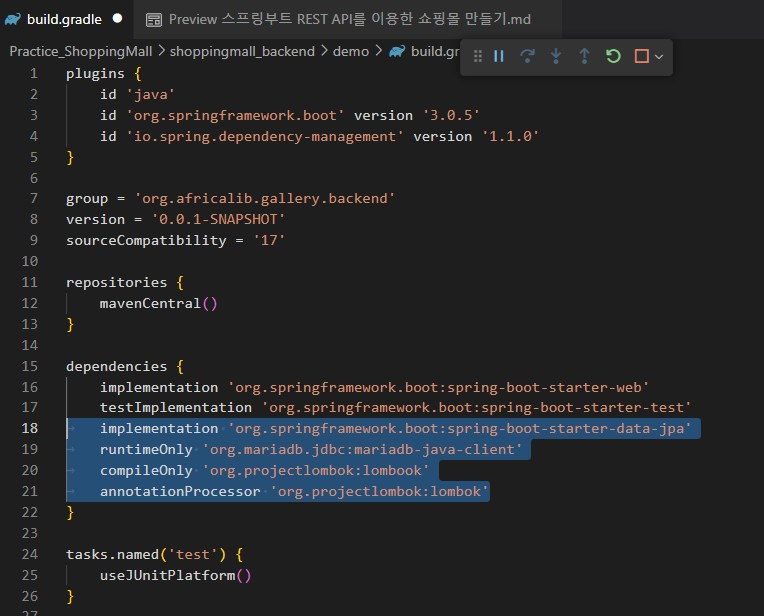

> 3. main > java > org > africalib > gallery > backend > demo 안에 'entity' 패키지 (폴더) 추가
> 4. entity 안에 **item.java** 클래스 생성
> 5. 아래 코드와 같이 작성
```java
package org.africalib.gallery.backend.demo.entity;

import jakarta.persistence.Column;
import jakarta.persistence.Entity;
import jakarta.persistence.GeneratedValue;
import jakarta.persistence.GenerationType;
import jakarta.persistence.Id;
import jakarta.persistence.Table;
import lombok.Getter;

@Getter
@Entity
@Table(name = "items") // 클래스와 items 테이블 매핑
public class Item {

    @Id
    @GeneratedValue(strategy = GenerationType.IDENTITY) // 자동증가값
    private int id; // columns에 있는 id와 매핑

    @Column(length = 50, nullable = false)
    private String name; // 멤버변수 추가
}
```

> 6. repositoty 폴더를 만들고 그 안에 **ItemRepository.java** 클래스 생성
> 7. 아래 코드와 같이 작성
```java
package org.africalib.gallery.backend.demo.repository;

import org.africalib.gallery.backend.demo.entity.Item;
import org.springframework.data.jpa.repository.JpaRepository;

public interface ItemRepository extends JpaRepository<Item, Integer>{
    
}
```
> 8. controller 폴더 (패키지)를 만들고 **ItemController.java** 파일을 해당 위치로 옮기기
> 9. **ItemController.java**에서 아래 코드와 같이 작성

```java
package org.africalib.gallery.backend.demo.controller;


import java.util.List;

import org.africalib.gallery.backend.demo.entity.Item;
import org.africalib.gallery.backend.demo.repository.ItemRepository;
import org.springframework.beans.factory.annotation.Autowired;
import org.springframework.web.bind.annotation.GetMapping;
import org.springframework.web.bind.annotation.RestController;

@RestController
public class ItemController {

    @Autowired
    ItemRepository itemRepository;
    @GetMapping("/api/items")
    public List<Item> getItems() {
        List<Item> items = itemRepository.findAll();
        return items;
    }
}
```
> 10. src > main > resources 폴더 안의 **application.properties** 파일 실행
> 11. 아래와 같이 코드 추가 후 저장

```
spring.datasource.driver-class-name=org.mariadb.jdbc.Driver
spring.datasource.url=jdbc:mariadb://localhost:3306/gallery
spring.datasource.username=root
spring.datasource.password=bdairam!@#
```

> 12. 백엔드 스프링 부트 실행시켜서  
> http://localhost:8080/api/items 접속  
> 아래 이미지같이 나오면 성공 
> 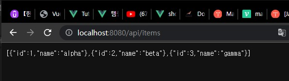  

<br>
<br>

---

# 6. 상품 진열 및 DB 칼럼 추가

# 7. Vue Router 추가
# 8. 로그인 기능 구현
# 9. Vuex로 로그인 보완
# 10. JWT로 로그인 보완
# 11. 로그인 체크 로직 보완
# 12. 장바구니 기능 구현 1
# 13. 장바구니 기능 구현 2
# 14. 장바구니 기능 구현 3
# 15. 주문 기능 구현
# 16. 기능 보완
# 17. 맺음말

